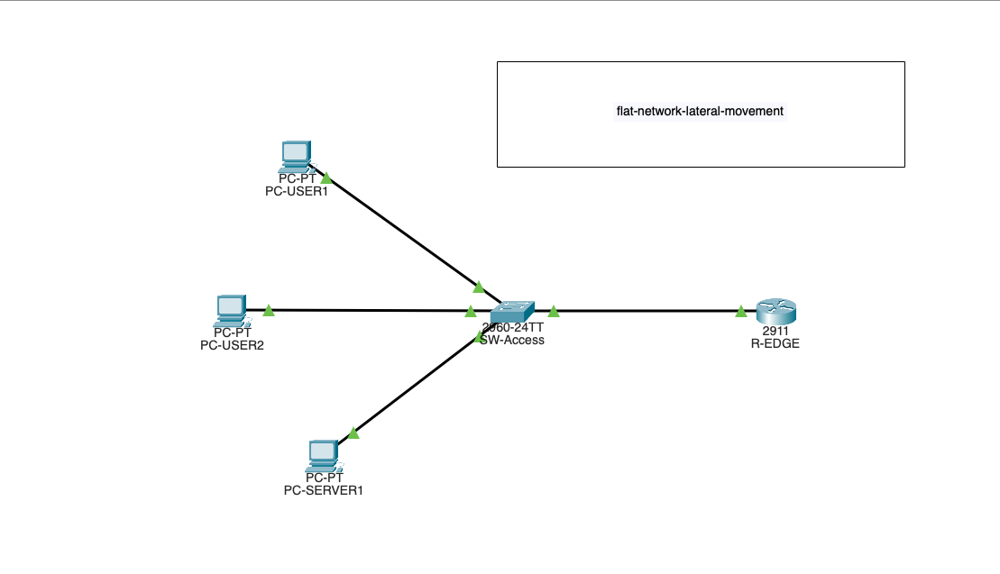

# Flat Network Lateral Movement Lab

## Overview
This lab demonstrates how a flat enterprise network design enables unrestricted lateral movement following a single host compromise.

Rather than focusing on exploitation techniques, this lab analyzes how the absence of segmentation and monitoring allows an attacker to move freely across systems with minimal resistance or visibility.

---

## Lab Objectives

- Design a flat enterprise-style network
- Analyze attacker movement after initial access
- Identify missing security and detection controls
- Understand why lateral movement often goes unnoticed
- Establish a baseline for why segmentation matters

---

## Network Design

The network consists of:
- A single flat subnet
- Multiple hosts representing users and servers
- No internal segmentation or access controls
- Minimal monitoring or logging
  
- **Network Topology**

This design reflects many real-world environments that prioritize simplicity over security.

---

## Threat Model & Attack Path

This lab models a common flat enterprise access network where user workstations and critical internal services reside on the same subnet.

Assumed attack path:
1. Initial compromise of a user workstation (phishing, credential theft, or malware).
2. Unrestricted Layer 3 connectivity allows direct reachability to internal servers.
3. No segmentation or access controls exist to limit east-west movement.
4. A single compromised endpoint enables access to all internal assets.

**Security Implications**

In a flat network:
- Lateral movement requires no exploitation of network controls.
- East-west traffic appears legitimate at the network layer.
- Detection relies entirely on endpoint or application visibility.
- Network-based containment is not possible without segmentation.   

This lab focuses on understanding *why* movement is possible, not just that it is.

---

## Segmentation & Security Controls
- VLAN 10: Users (10.10.10.0/24)
- VLAN 20: Servers (10.10.20.0/24)
- Inter-VLAN routing via router-on-a-stick
- Extended ACL applied inbound on VLAN 10 to block user initiation toward servers
- Internal DNS enabled on server VLAN for resolution without granting access

---

## Validation
- Users can communicate within their VLAN
- User-to-server traffic is blocked
- Server-to-user responses are permitted
- DNS resolution works without compromising access control

---

## Mitigation Preview

**Access Control Enforcement**

An extended ACL was applied inbound on the user VLAN to restrict initiation of traffic toward server assets.

This control effectively prevents lateral movement from compromised user endpoints while preserving required routing and response traffic.

This lab serves as the insecure baseline for comparison.

---

## Key Takeaways
- Flat networks allow trivial lateral movement
- VLAN segmentation alone is insufficient for security
- Layer 3 access controls enforce least privilege without disrupting operations
- Internal services like DNS increase asset visibility but can be safely controlled

---

## Files

## Next Steps
This lab sets a foundation for demonstrating DMZs, logging, and detection, or more advanced ACL scenarios in future labs.
